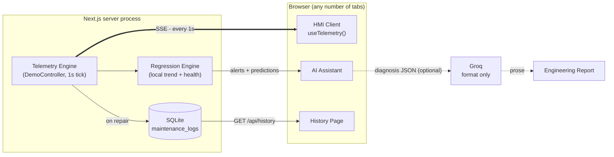

# SenseGrid AI

**An adaptive Human-Machine Interface for predictive maintenance — built on a real server-owned simulation, live Server-Sent Events telemetry, a persistent SQLite history, and an LLM that is only ever allowed to format a report, never to diagnose one.**

Built for the Schneider Smart HMI Innovation Marathon.

---

## Project Overview

SenseGrid AI is a full-stack industrial HMI that monitors a simulated machine — and the operator watching it — in real time. It looks and behaves like a production EcoStruxure-style control panel: live gauges, an interactive SVG digital twin, explainable fault cards, and a persistent maintenance history, all driven by a single deterministic simulation running on the server and streamed to every connected client over Server-Sent Events.

It was built to answer a specific question: **can a predictive-maintenance dashboard be genuinely explainable end to end** — every number traceable to a formula you can read, with AI used only where it belongs (turning structured data into prose), never as a black box making the actual call?

## Problem Statement

Most predictive-maintenance dashboards fall into one of two traps:

1. **Threshold-only alerting** — a value crosses a fixed line and an alarm fires, with no warning that it was coming and no explanation of why.
2. **Black-box AI diagnosis** — a model outputs "87% chance of failure" with no visibility into how that number was produced, which is a hard sell to an engineer who has to sign off on a maintenance action.

Neither approach helps an operator *before* things go wrong, and neither is auditable enough for a real industrial setting where every alert needs a traceable root cause.

## Solution

SenseGrid AI addresses both problems directly:

- **Trend-based early warning.** Instead of waiting for a threshold breach, an ordinary least-squares regression runs continuously over recent sensor history. A sustained upward trend in vibration triggers an *Early Warning* alert with a computed time-to-failure — before the value ever reaches the critical band.
- **Operator-adaptive interface.** A simulated cognitive-load score (driven by active alert count, unacknowledged alerts, and response time) reshapes the dashboard itself under pressure — secondary analytics disappear, the emergency acknowledge control enlarges, and contrast increases.
- **Strict separation of prediction and language.** Every health percentage, alert, root cause, and time-to-failure estimate is computed by deterministic local code. An LLM (Groq) is invoked *only* to rewrite an already-finalized diagnosis into professional prose — it is instructed, in its system prompt, that it may not add, adjust, or infer a single value.

## Features

- **Live Dashboard** — health score, temperature, vibration, current, RPM, dual-axis trend charts, and an active-alerts panel, all updating once a second.
- **Universal Digital Twin** — switch between an Industrial Motor and a Laptop visualization, both hand-drawn in SVG, both driven by the same underlying telemetry.
- **AI Assistant** — explainable fault cards (confidence, trend duration, root cause, recommended action) generated from local regression, plus an on-demand Groq-formatted Engineering Report and a one-click PDF export.
- **History** — a persistent maintenance timeline backed by SQLite, with Today / Last Demo / All filters and live sensor/health recovery charts.
- **Auto Demo Mode** — a scripted, deterministic 30-second Healthy → Early Warning → Critical → Maintenance → Recovering loop, controllable via Start / Pause / Reset from the top command bar, plus a confirmable **Emergency Stop** that forces Safe Mode and logs the shutdown.
- **System Architecture** — an in-app page that documents (and live-visualizes) the exact plumbing described below.
- **Resilient by design** — the client reconnects automatically if the SSE stream drops, showing "Disconnected" and preserving the last known telemetry rather than blanking the screen.

## Architecture

The server owns the simulation. Every browser tab is a thin, reactive client.



Every page — Dashboard, Digital Twin, AI Assistant, History — subscribes through the same `useTelemetry()` hook, so they are guaranteed to render a consistent snapshot of the same server state; there is no per-page polling or divergent local timers.

## Technology Stack

| Layer | Choice | Why |
|---|---|---|
| Framework | **Next.js 16** (App Router) | One process serves every page and every API route — pages and backend share the same deploy unit. |
| Language | **TypeScript** (strict) | The simulation, regression, and telemetry contracts are shared types end to end, client and server. |
| Realtime | **Server-Sent Events** | A single persistent, one-directional stream is simpler and more robust than WebSockets for a server-authoritative feed. |
| Persistence | **SQLite** via `better-sqlite3` | Zero-config, file-based, synchronous — perfect for a single-process maintenance log. |
| Charts | **Recharts** | Every live trend chart — health recovery, sensor history, dual-axis dashboards. |
| Motion | **Framer Motion** | Gauge counting, phase transitions, twin-profile crossfades, confirmation dialogs. |
| Digital Twin | **Inline SVG** | Both device profiles are hand-drawn vector illustrations — no image assets, fully theme- and state-driven. |
| Reports | **Groq API** (LLM) + **pdf-lib** | Groq formats prose reports; pdf-lib generates the downloadable PDF entirely client-side. |

## Universal Digital Twin

The Digital Twin page renders one of two profiles, selected from the sidebar, without ever touching the underlying simulation:

- **Industrial Motor** (default) — Bearing, Drive Motor, Drive Shaft, Cooling Fan.
- **Laptop** — CPU, RAM, SSD, Battery, Cooling Fan, Motherboard.

Both profiles are pure *mappings* over the same four simulated component-health values (`lib/twinProfiles.ts`) — for example the Laptop's CPU health is literally the Motor's bearing health, since both represent "the component most likely to fail first" in their respective domain. Clicking any component opens the same inspection drawer regardless of profile, showing health %, temperature, utilization, failure probability, and remaining useful life. Switching profiles never affects the AI Assistant, History, or Operator Load — those reflect the one true simulation, independent of which twin is on screen.

## Backend (SSE + SQLite)

- **`GET /api/telemetry`** streams one JSON frame per second over Server-Sent Events. The very first frame is sent immediately on connect so a new tab doesn't wait a full second for its first paint.
- **`POST /api/telemetry`** accepts `{ action: "start" | "pause" | "reset" | "acknowledge" | "emergency_stop" }` — every connected tab sees the effect instantly, since it's the same server-side engine broadcasting to all subscribers.
- **`GET /api/history`** / **`POST /api/history/reset`** read and clear the `maintenance_logs` SQLite table.
- **`POST /api/report`** builds a structured diagnosis from live telemetry and either sends it to Groq or falls back to a deterministic local formatter if `GROQ_API_KEY` is unset.

The engine itself (`lib/server/telemetryEngine.ts`) is a `globalThis`-guarded singleton, so Next.js dev-mode hot reload never spins up a second ticking interval — there is always exactly one clock driving the whole app.

## Explainable AI

This is the core design constraint of the project, not an afterthought:

1. **Regression performs prediction.** Trend direction, confidence, and time-to-failure come from an ordinary least-squares regression over real sensor history (`lib/prediction.ts`, `lib/demo.ts`). This never touches an LLM.
2. **The LLM only formats reports.** When you press *Generate Engineering Report*, Groq receives a structured, already-computed diagnosis JSON under a system prompt that explicitly forbids it from adding, adjusting, or inventing a single value — its only job is turning that JSON into professional prose.
3. **No black-box diagnosis.** Every health percentage, alert, and root cause shown anywhere in the app traces back to a deterministic function you can open and read yourself.

If `GROQ_API_KEY` is missing or the API call fails for any reason, the app falls back to a locally template-formatted report automatically — the feature degrades gracefully, it never breaks.

## Screenshots

> _Add screenshots here before publishing — e.g._

| Dashboard | Digital Twin | AI Assistant |
|---|---|---|
|  |  |  |

| History | System Architecture |
|---|---|
|  |  |

## Installation

Requires Node.js 20+.

```bash
git clone <this-repo-url>
cd sensegrid-ai
npm install
```

Copy the environment template and, optionally, add a Groq API key (the app works fully without one — the Engineering Report just falls back to a local formatter):

```bash
cp .env.example .env.local
# GROQ_API_KEY=your-key-here   (optional)
```

## Running Locally

```bash
npm run dev
```

Open [http://localhost:3000](http://localhost:3000). A SQLite file (`sensegrid.db`) is created automatically on first run.

Other scripts:

```bash
npm run build   # production build
npm run start   # run the production build
npm run lint    # eslint
```

## Future Scope

- **Multi-machine fleet view** — extend the single-machine simulation to a fleet dashboard with per-asset drill-down.
- **Real sensor ingestion** — swap the deterministic `DemoController` for an adapter that ingests real MQTT/OPC-UA telemetry, keeping the SSE/SQLite/UI layers unchanged.
- **Role-based access** — operator vs. maintenance-engineer views, with the operator-adaptive UI logic extended to real workload signals (e.g. actual click/response telemetry instead of a simulated score).
- **Alert acknowledgment audit trail** — persist acknowledgments to SQLite alongside maintenance logs for full traceability.
- **Additional digital twin profiles** — the `twinProfiles.ts` mapping pattern is designed to extend to new device types without touching the simulation engine.
